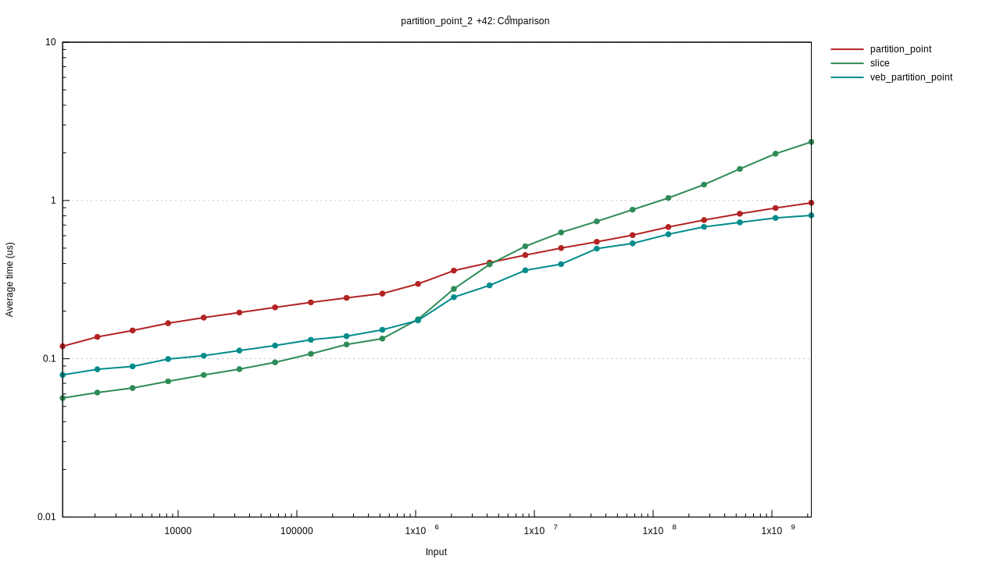
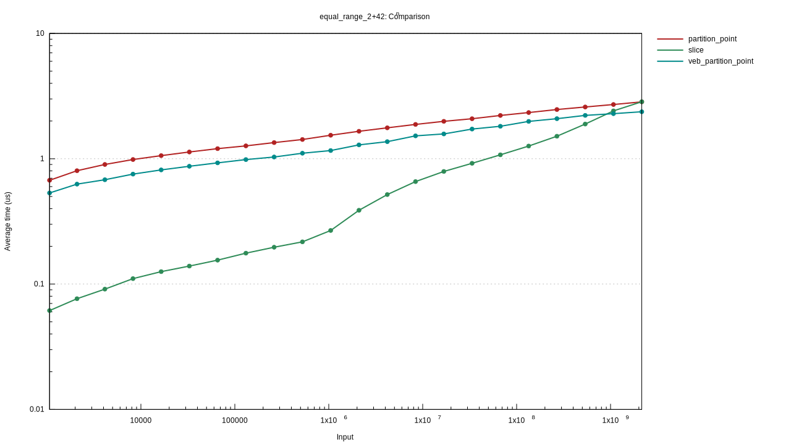

vEB(van Emde Boas) layout `partition_point` (cache oblivious)

```rust
use partition_point_veb_layout::*;
let v = vec![0, 0, 1, 2, 2, 4, 6];
let lb = v.partition_point(|x| x < &2);
let w = veb_layout(&v);
let vlb = veb_partition_point(&w, |x| x < &2);
assert_eq!(lb, veb_index_rev(vlb, v.len()));
```

On larger than LLC(Last Level Cache), `veb_partition_point` is faster than [slice's `partition_point`](https://doc.rust-lang.org/std/primitive.slice.html#method.partition_point).



But, get `&v[lower_bound..upper_bound]` is not fast. It takes `O((upper_bound-lower_bound)*log(v.len()))`.



CPU: Ryzen7 2700X
MEM: DDR4 2666MHz 2ch 64GB
RUSTC: rustc 1.60.0-beta.3
